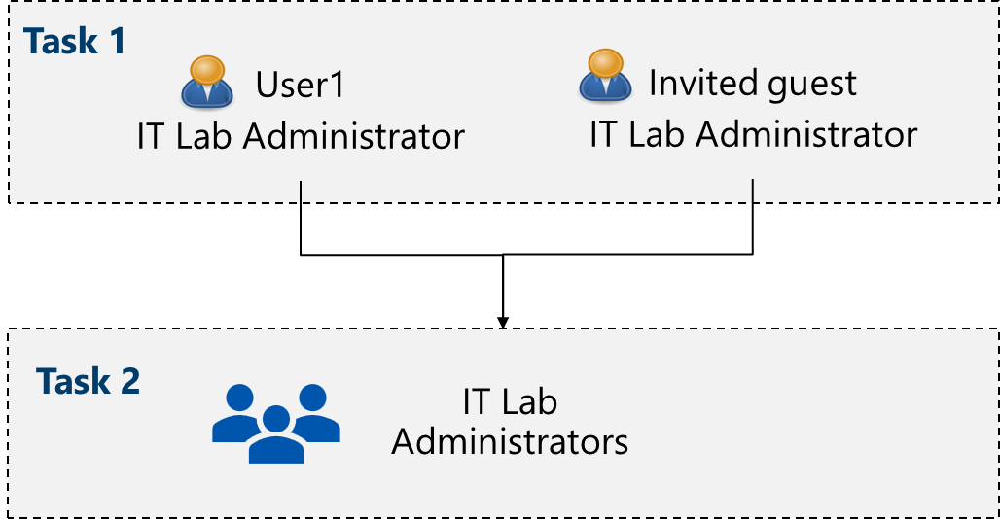

---
lab:
  title: 實驗室 01：管理 Microsoft Entra ID 身分識別
  module: Administer Identity
---

# 實驗室 01 - 管理 Microsoft Entra ID 身分識別

## 實驗室簡介

這是 Azure 管理員 istrators 系列實驗室中的第一個。 在此實驗室中，您將了解使用者和群組。 使用者和群組是身分識別解決方案的基本建置組塊。 

## 預估時間：30 分鐘

## 實驗案例

您的組織正在建置新的實驗室環境，以預先測試應用程式和服務。  一些工程師正被雇用來管理實驗室環境，包括虛擬機。 為了允許工程師使用 Microsoft Entra ID 進行驗證，您已負責布建使用者和群組。 若要將系統管理額外負荷降到最低，應該根據職稱自動更新群組的成員資格。 

## 互動式實驗室模擬

此實驗室使用互動式實驗室模擬。 模擬可讓您以自己的步調點選類似的案例。 互動式模擬和此實驗室之間有差異，但許多核心概念都相同。 不需要 Azure 訂用帳戶。

>**注意：** 正在更新此模擬。 Microsoft Entra ID 是 Azure Active Directory 的新名稱（Azure AD）。 

+ [管理 Entra ID Identities](https://mslabs.cloudguides.com/guides/AZ-104%20Exam%20Guide%20-%20Microsoft%20Azure%20Administrator%20Exercise%201)。 建立和設定使用者並指派給群組。 建立 Azure 租使用者並管理來賓帳戶。 

## 架構圖

## 作業技能

+ 工作 1：建立及設定用戶帳戶。
+ 工作 2：建立群組並新增成員。

## 工作 1：建立及設定用戶帳戶

在這項工作中，您將建立及設定用戶帳戶。 用戶帳戶會儲存用戶數據，例如名稱、部門、位置和聯繫人資訊。

1. 登入 **Azure 入口網站** - `https://portal.azure.com`。

    >**注意：** 所有實驗室都會使用 Azure 入口網站。 如果您不熟悉 Azure，請搜尋並選取 `Quickstart Center`。 請花幾分鐘的時間觀看 **Azure 入口網站** 影片中的開始使用。 即使您之前曾使用過入口網站，您也會找到流覽和自定義介面的一些秘訣和訣竅。
    
1. 搜尋並選取 `Microsoft Entra ID`。 Microsoft Entra ID 是 Azure 的雲端式身分識別和存取管理解決方案。 花幾分鐘的時間熟悉左窗格中所列的一些功能。 

1. 選取 [概 **觀]** 刀鋒視窗，然後選取 [ **管理租使用者] 索引標籤** 。 

    >**你知道嗎？** 租使用者是包含帳戶和群組的特定 Microsoft Entra 標識符實例。 根據您的情況，您可以建立更多租使用者，並在 **他們之間切換** 。 

1. 返回 **[項目標識符** ] 頁面，然後選取 [ **授權**]。 您可以從這裏購買授權、管理您擁有的授權，以及將授權指派給使用者和群組。 選取 **[授權功能** ] 以查看可用的功能。
   
### 建立新的使用者

1. 選取 **[使用者**]，然後在 [ **新增使用者** ] 下拉式清單中選取 **[建立新使用者**]。 

1. 使用下列設定建立新使用者（將其他人保留為預設值）。 在 [ **屬性]** 索引標籤上，請注意使用者帳戶中包含的所有不同類型的資訊。 

    | 設定 | 值 |
    | --- | --- |
    | 使用者主體名稱 | `az104-user1` |
    | Display name | `az104-user1` |
    | 自動產生密碼 | **checked** |
    | 已啟用帳戶 | **checked** |
    | 職稱 （屬性索引標籤） | `IT Lab Administrator` |
    | 部門 （屬性索引標籤） | `IT` |
    | 使用位置 （屬性索引標籤） | **美國** |

1. 完成檢閱之後，請選取 [檢閱 + 建立 **]，然後**選取 **[建立**]。

1. 重新整理頁面，並確認新使用者已建立。 

### 邀請外部使用者

1. 在 [ **新增使用者** ] 下拉式清單中，選取 [ **邀請外部使用者**]。 

    | 設定 | 值 |
    | --- | --- |
    | 電子郵件 | 您的電子郵件地址 |
    | Display name | 您的姓名 |
    | 傳送邀請訊息 | **核取方塊** |
    | 訊息 | `Welcome to Azure and our group project` |

1. 移至 [ **屬性]** 索引標籤。完成基本資訊，包括這些欄位。 

    | 設定 | 值 |
    | --- | --- |
    | 職稱  | `IT Lab Administrator` |
    | 部門  | `IT` |
    | 使用位置 （屬性索引標籤） | **美國** |

1. 選取 [檢閱 + 邀請 **]，然後**選取 **[邀請**]。

1. **重新** 整理頁面，並確認已建立受邀的使用者。 您應該很快就會收到邀請電子郵件。 

    >**注意：** 您不太可能個別建立用戶帳戶。 您知道貴組織如何規劃建立和管理用戶帳戶？
    
## 工作 2：建立群組並新增成員

在這項工作中，您會建立群組帳戶。 組帳戶可以包含用戶帳戶或裝置。 這是將成員指派給群組的兩種基本方式：靜態和動態方式。 靜態群組需要系統管理員手動新增和移除成員。  動態群組會根據用戶帳戶或裝置的屬性自動更新。 例如，職稱。 

1. 在 Azure 入口網站 中，搜尋並選取 `Groups`。

1. 花一分鐘的時間熟悉左窗格中的群組設定。

   + **到期** 可讓您以天為單位設定群組存留期。 之後，擁有者必須更新群組。
   + **命名原則** 可讓您設定封鎖字組，並將前置詞或後綴新增至組名。

1. 在 [ **所有群組]** 刀鋒視窗中，選取 **[+ 新增群組** ]，然後建立新的群組。     

    | 設定 | 值 |
    | --- | --- |
    | 群組類型 | **安全性** |
    | 群組名稱 | `IT Lab Administrators` |
    | 群組描述 | `Administrators that manage the IT lab` |
    | 成員資格類型 | **已指派** |

    >**注意**：動態成員資格需要 Entra ID 進階版 P1 或 P2 授權。 如果有其他 **成員資格類型** 可用，選項會顯示在下拉式清單中。 
    
    

1. 選取 **[未選取**擁有者]。

1. 在 [ **新增擁有者** ] 頁面中，搜尋並 **選取** 您自己作為擁有者。 請注意，您可以有多個擁有者。 

1. 選取 **[未選取**成員]。

1. 在 [ **新增成員]** 窗格中，搜尋並 **選取** **az104-user1** 和您邀請的 **來賓使用者** 。 將這兩個使用者新增至群組。 

1. 選取 [ **建立]** 以部署群組。

1. **重新整理** 頁面，並確定您的群組已建立。

1. 選取新的群組，並檢閱 [成員 **] 和 **[** 擁有者**] 資訊。

>**注意：** 您可能會管理大量群組。 您的組織是否有建立群組和新增成員的計劃？
   
## 清除您的資源

如果您使用自己的訂用 **帳戶** ，需要一分鐘的時間才能刪除實驗室資源。 這可確保資源可以釋出，並將成本降到最低。 刪除實驗室資源最簡單的方式是刪除實驗室資源群組。 

+ 在 Azure 入口網站 中，選取資源群組、選取 **[刪除資源群組**]、**輸入資源組名**，然後按兩下 [**刪除**]。
+ 使用 Azure PowerShell， `Remove-AzResourceGroup -Name resourceGroupName`。
+ 使用 CLI， `az group delete --name resourceGroupName`。
  
## 重要心得

恭喜您完成實驗室。 以下是此實驗室的一些主要方法：

+ 租使用者代表您的組織，並協助您管理內部和外部使用者的特定 Microsoft 雲端服務實例。
+ Microsoft Entra ID 具有使用者和來賓帳戶。 每個帳戶都有一個層級的存取權，專屬於預期要完成的工作範圍。
+ 群組會將相關用戶或裝置結合在一起。 有兩種類型的群組，包括安全性和 Microsoft 365。
+ 群組成員資格可以靜態或動態指派。

## 透過自學型訓練深入了解

+ [瞭解 Microsoft Entra 識別符](https://learn.microsoft.com/training/modules/understand-azure-active-directory/)。 比較 Microsoft Entra ID 與 Active Directory DS、瞭解 Microsoft Entra ID P1 和 P2，並探索 Microsoft Entra Domain Services 來管理雲端中加入網域的裝置和應用程式。
+ [在 Microsoft Entra ID](https://learn.microsoft.com//training/modules/create-users-and-groups-in-azure-active-directory/) 中建立 Azure 使用者和群組。 在 Microsoft Entra ID 中建立使用者。 了解不同類型的群組。 建立群組和新增成員。 管理企業對企業的來賓帳戶。
+ [允許使用者使用 Microsoft Entra 自助式密碼重設來重設其密碼](https://learn.microsoft.com/training/modules/allow-users-reset-their-password/)。 評估自助式密碼重設，以允許組織中的使用者重設其密碼或解除鎖定其帳戶。 安裝、設定及測試自助式密碼重設。

