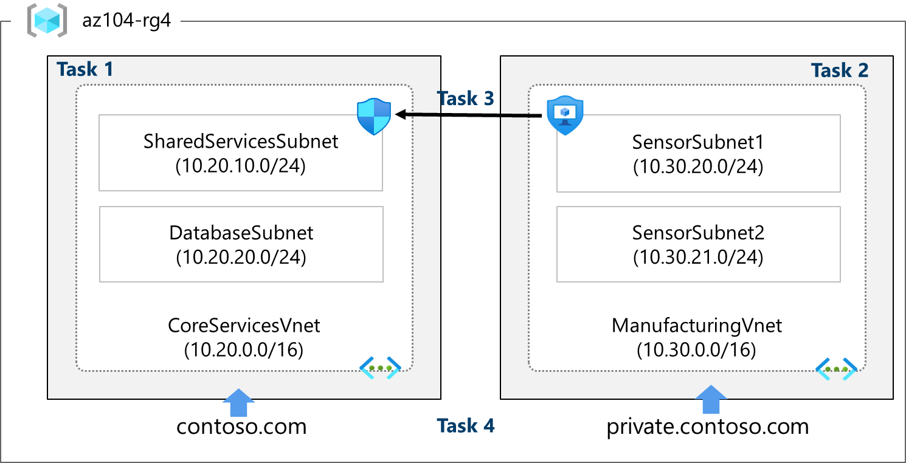

---
lab:
  title: 實驗室 04：實作虛擬網路
  module: Implement Virtual Networking
---

# 實驗 04 - 實作虛擬網路

## 實驗室簡介

此實驗室是著重於虛擬網路的三個實驗室中的第一個。 在此實驗室中，您將瞭解虛擬網路和子網的基本概念。 您將瞭解如何使用網路安全組和應用程式安全組保護您的網路。 您也會瞭解 DNS 區域和記錄。 

此實驗室需要 Azure 訂用帳戶。 您的訂用帳戶類型可能會影響此實驗室中功能的可用性。 您可以變更區域，但步驟是使用 **美國**東部撰寫。

## 估計時間：50 分鐘

## 實驗案例 

您的全域組織計劃實作虛擬網路。 立即的目標是要容納所有現有的資源。 不過，組織處於成長階段，並想要確保有額外的成長容量。

**CoreServicesVnet** 虛擬網路具有最大的資源數目。 預期會有大量成長，因此此虛擬網路需要大型位址空間。

**ManufacturingVnet** 虛擬網路包含製造設施作業的系統。 組織預期其系統要從中擷取數據的大量內部連線裝置。 

## 互動式實驗室模擬

您可能會發現數個互動式實驗室模擬適合本主題。 模擬可讓您以自己的步調點選類似的案例。 互動式模擬和此實驗室之間有差異，但許多核心概念都相同。 不需要 Azure 訂用帳戶。 

+ [保護網路流量](https://mslearn.cloudguides.com/en-us/guides/AZ-900%20Exam%20Guide%20-%20Azure%20Fundamentals%20Exercise%2013)。 建立虛擬機、虛擬網路和網路安全組。 新增網路安全組規則，以允許和不允許流量。
  
+ [建立簡單的虛擬網路](https://mslearn.cloudguides.com/en-us/guides/AZ-900%20Exam%20Guide%20-%20Azure%20Fundamentals%20Exercise%204)。 建立具有兩部虛擬機的虛擬網路。 示範虛擬機可以通訊。 

+ [在 Azure](https://mslabs.cloudguides.com/guides/AZ-700%20Lab%20Simulation%20-%20Design%20and%20implement%20a%20virtual%20network%20in%20Azure) 中設計和實作虛擬網路。 建立資源群組，並使用子網建立虛擬網路。  

+ [實作](https://mslabs.cloudguides.com/en-us/guides/AZ-104%20Exam%20Guide%20-%20Microsoft%20Azure%20Administrator%20Exercise%208)虛擬網路。 建立和設定虛擬網路、部署虛擬機、設定網路安全組，以及設定 Azure DNS。

## 架構圖



這些虛擬網路和子網的結構化方式可容納現有的資源，但允許預測的成長。 讓我們建立這些虛擬網路與子網路，為我們的網路基礎結構奠定基礎。

>**您知道嗎？**：最好避免重疊的IP位址範圍，以減少問題並簡化疑難解答。 重迭是整個網路的問題，無論是雲端還是內部部署。 許多組織都會設計全企業IP尋址配置，以避免重疊並規劃未來成長。

## 作業技能

+ 工作 1：使用入口網站建立具有子網的虛擬網路。
+ 工作 2：使用範本建立虛擬網路和子網。
+ 工作3：建立和設定應用程式安全組與網路安全組之間的通訊。
+ 工作 4：設定公用和私人 Azure DNS 區域。
  
## 工作 1：使用入口網站建立具有子網的虛擬網路

組織會規劃核心服務的大量成長。 在這項工作中，您會建立虛擬網路和相關聯的子網，以容納現有的資源和計劃成長。 在此工作中，您將使用 Azure 入口網站。 

1. 登入 **Azure 入口網站** - `https://portal.azure.com`。
   
1. 搜尋並選取 `Virtual Networks`。

1. 在 [虛擬網路] 頁面上，選取 [建立]****。

1. 完成 CoreServicesVnet 的 [ **基本]** 索引標籤。  

    |  **選項**         | **值**            |
    | ------------------ | -------------------- |
    | 資源群組     | `az104-rg4` （如有必要，請建立新） |
    | 名稱               | `CoreServicesVnet`     |
    | 區域             | （美國） **美國東部**         |

1. 移至 [ **IP 位址] 索引** 標籤。

    |  **選項**         | **值**            |
    | ------------------ | -------------------- |
    | IPv4 位址空間 | `10.20.0.0/16` （分隔專案）    |

1. 選取 [+ 新增子網路]****。 完成每個子網的名稱和地址資訊。 請務必為每個新子網選取 [ **新增** ]。 

    | **子網路**             | **選項**           | **值**              |
    | ---------------------- | -------------------- | ---------------------- |
    | SharedServicesSubnet   | 子網路名稱          | `SharedServicesSubnet`   |
    |                        | 起始位址     | `10.20.10.0`          |
    |                        | 大小                 | `/24` |
    | DatabaseSubnet         | 子網路名稱          | `DatabaseSubnet`         |
    |                        | 起始位址     | `10.20.20.0`        |
    |                        | 大小                 | `/24` |

    >**注意：** 每個虛擬網路都必須至少有一個子網。 提醒您一律保留五個IP位址，因此請考慮在規劃中。 

1. 若要完成建立 CoreServicesVnet 及其相關聯的子網路，請選取 [檢閱 + 建立]****。

1. 確認您的設定已通過驗證，然後選取 [建立]****。

1. 等候虛擬網路部署，然後選取 **[移至資源**]。

1. 花一分鐘的時間確認 **位址空間** 和 **子網**。 請注意您在 [設定]** 刀鋒視窗中的其他選擇**。 

1. 在 [自動化 **] 區**段中，選取 **[導出範本**]，然後等候產生範本。

1. **下載** 範本。

1. 在本機計算機上流覽至 **[下載]** 資料夾，然後 **解壓縮** 所下載 zip 檔案中的所有檔案。 

1. 繼續之前，請確定您有 **template.json** 檔案。 您將使用此範本在下一個工作中建立 ManufacturingVnet。 
 
## 工作 2：使用範本建立虛擬網路和子網

在這項工作中，您會建立ManufacturingVnet虛擬網路和相關聯的子網。 組織預期製造業辦公室的成長，因此子網的大小會隨著預期的成長而調整規模。 針對這項工作，您會使用範本來建立資源。 

1. 找出在上 **一個工作中導出的template.json** 檔案。 它應該位於 [ **下載]** 資料夾中。

1. 使用您選擇的編輯器編輯檔案。 許多編輯器都有 *所有出現的* 變更功能。 如果您使用 Visual Studio Code，請確定您是在信任的視窗中**工作**，而不是在受限制模式**中**工作。 請參閱架構圖表以驗證詳細數據。 

### 對 ManufacturingVnet 虛擬網路進行變更

1. 將所有出現的 **CoreServicesVnet** 取代為 `ManufacturingVnet`。 

1. 將所有出現的 **10.20.0.0** 取代為 `10.30.0.0`。 

### 變更 ManufacturingVnet 子網

1. 將所有出現的 **SharedServicesSubnet** 變更為 `SensorSubnet1`。

1. 將所有出現的 **10.20.10.0/24** 變更為 `10.30.20.0/24`。

1. 將所有出現的 **DatabaseSubnet** 變更為 `SensorSubnet2`。

1. 將所有出現的 **10.20.20.0/24** 變更為 `10.30.21.0/24`。

1. 讀取檔案，並確保所有專案看起來都正確。

1. 請務必**儲存**您的變更。

>**注意：** 實驗室檔案目錄中有已完成的範本檔案。 

### 對參數檔案進行變更

1. 找出在上 **一個工作中導出的parameters.json** 檔案。 它應該位於 [ **下載]** 資料夾中。

1. 使用您選擇的編輯器編輯檔案。

1. 將其中一個出現的 **CoreServicesVnet** 取代為 `ManufacturingVnet`。

1. **儲存**您的變更。
   
### 部署自定義範本

1. 在入口網站中，搜尋並選取 **[部署自定義範本**]。

1. 在編輯器中選取 **[建置您自己的範本]，然後**選取 [載入檔案**]。**

1. 選取 **具有製造變更的** templates.json檔案，然後選取 [ **儲存**]。

1. 選取 [檢閱 + 建立]****，然後選取 [建立]****。

1. 等候範本部署，然後確認 （在入口網站中） 已建立製造虛擬網路和子網。

>**注意：** 如果您必須部署一次以上，您可能會發現某些資源已順利完成，且部署失敗。 您可以手動移除這些資源，然後再試一次。 
   
## 工作3：建立和設定應用程式安全組與網路安全組之間的通訊

在這項工作中，我們會建立應用程式安全組和網路安全組。 NSG 會有允許來自 ASG 流量的輸入安全性規則。 NSG 也會有一個輸出規則，拒絕存取因特網。 

### 建立應用程式安全組 （ASG）

1. 在 Azure 入口網站 中，搜尋並選取 `Application security groups`。

1. 按兩下 [ **建立** ]，並提供基本資訊。

    | 設定 | 值 |
    | -- | -- |
    | 訂用帳戶 | *訂用帳戶* |
    | 資源群組 | **az104-rg4** |
    | 名稱 | `asg-web` |
    | 區域 | **美國東部**  |

1. 按兩下 [ **檢閱 + 建立** ]，然後在驗證之後按兩下 [ **建立**]。

### 建立網路安全組並將它與 ASG 子網產生關聯

1. 在 Azure 入口網站 中，搜尋並選取 `Network security groups`。

1. 選取 **[+ 建立** ]，並在 [ **基本] 索引** 標籤上提供資訊。 

    | 設定 | 值 |
    | -- | -- |
    | 訂用帳戶 | *訂用帳戶* |
    | 資源群組 | **az104-rg4** |
    | 名稱 | `myNSGSecure` |
    | 區域 | **美國東部**  |

1. 按兩下 [ **檢閱 + 建立** ]，然後在驗證之後按兩下 [ **建立**]。

1. 部署 NSG 之後，按兩下 **[移至資源**]。

1. 在 [設定] 下****，按兩下 [**子網**]，然後按兩下 [**關聯**]。

    | 設定 | 值 |
    | -- | -- |
    | 虛擬網路 | **CoreServicesVnet （az104-rg4）** |
    | 子網路 | **SharedServicesSubnet** |

1. 按兩下 [ **確定** ] 以儲存關聯。

### 設定輸入安全性規則以允許 ASG 流量

1. 繼續使用您的 NSG。 在 **[設定**] 區域中，選取 [**輸入安全性規則**]。

1. 檢閱預設輸入規則。 請注意，只允許其他虛擬網路和負載平衡器存取。

1. 選取 **+ 新增**。

1. 在 [ **新增輸入安全性規則]** 刀鋒視窗上，使用下列資訊來新增輸入埠規則。 此規則允許 ASG 流量。 當您完成時，請選取 [ **新增**]。

    | 設定 | 值 |
    | -- | -- |
    | 來源 | **應用程式安全性群組** |
    | 來源應用程式安全組 | **asg-web** |
    | 來源連接埠範圍 |  * |
    | Destination | **任何** |
    | 服務 | **自訂** （請注意您的其他選擇） |
    | 目的地連接埠範圍 | **80,443** |
    | 通訊協定 | **TCP** |
    | 動作 | **允許** |
    | 優先順序 | **100** |
    | 名稱 | `AllowASG` |

### 設定拒絕因特網存取的輸出 NSG 規則

1. 建立輸入 NSG 規則之後，請選取 [ **輸出安全性規則**]。 

1. **請注意 AllowInternetOutboundRule** 規則。 另請注意，無法刪除規則，且優先順序為 65001。

1. 選取 **[+ 新增** ]，然後設定拒絕存取因特網的輸出規則。 當您完成時，請選取 [ **新增**]。

    | 設定 | 值 |
    | -- | -- |
    | 來源 | **任何** |
    | 來源連接埠範圍 |  * |
    | 目的地 | **服務標記** |
    | 目的地服務標籤 | **網際網路** |
    | 服務 | **自訂** |
    | 目的地連接埠範圍 | **8080** |
    | 通訊協定 | **任何** |
    | 動作 | **拒絕** |
    | 優先順序 | **4096** |
    | 名稱 | **DenyAnyCustom8080Outbound** |


## 工作 4：設定公用和私人 Azure DNS 區域

在這項工作中，您將建立及設定公用和私人 DNS 區域。 

### 設定公用 DNS 區域

您可以設定 Azure DNS 以解析您公用網域中的主機名稱。 例如，如果您從功能變數名稱註冊機構購買 contoso.xyz 功能變數名稱，您可以設定 Azure DNS 來裝載 `contoso.com` 網域，並將 www.contoso.xyz 解析為 Web 伺服器或 Web 應用程式的 IP 位址。

1. 在入口網站中，搜尋 並選取 `DNS zones`。

1. 選取 **+ 建立**。

1. 設定 [ **基本] 索引** 標籤。

    | 屬性 | 值    |
    |:---------|:---------|
    | 訂用帳戶 | 選取您的訂用帳戶**** |
    | 資源群組 | **az04-rg4** |
    | 名稱 | `contoso.com` （ 如果保留調整名稱 ） |
    | 區域 |**美國** 東部 （檢閱資訊圖示） |

1. 選取 [檢閱建立]，然後選取 ****[建立**]。**
   
1. 等候 DNS 區域部署，然後選取 **[移至資源**]。

1. 在 [ **概觀]** 刀鋒視窗中，請注意指派給區域之四個 Azure DNS 名稱伺服器的名稱。 **複製** 其中一個名稱伺服器位址。 在未來的步驟中，您將需要用到它。 
  
1. 選取 [+ 記錄集]****。 為每個需要私人名稱解析支援的虛擬網路新增虛擬網路連結記錄。

    | 屬性 | 值    |
    |:---------|:---------|
    | 名稱 | **Www** |
    | 類型 | **A** |
    | TTL | **1** |
    | IP 位址 | **10.1.1.4** |

>**注意：**  在真實世界的案例中，您會輸入網頁伺服器的公用IP位址。

1. 選取 [**確定]，**並確認 **contoso.com 有名為 www** 的 **A 記錄集。**

1. 開啟命令提示字元，並執行下列命令：

   ```sh
   nslookup www.contoso.com <name server name>
   ```
1. 確認主機名 www.contoso.com 解析為您提供的IP位址。 這會確認名稱解析正常運作。

### 設定私人 DNS 區域

私人 DNS 區域會在虛擬網路內提供名稱解析服務。 私人 DNS 區域只能從連結至且無法從因特網存取的虛擬網路存取。 

1. 在入口網站中，搜尋 並選取 `Private dns zones`。

1. 選取 **+ 建立**。

1. 在 [建立私人 DNS 區域] 的 [ **基本] 索引** 標籤上，輸入下表所列的資訊：

    | 屬性 | 值    |
    |:---------|:---------|
    | 訂用帳戶 | 選取您的訂用帳戶**** |
    | 資源群組 | **az04-rg4** |
    | 名稱 | `private.contoso.com` （如果您必須重新命名，請調整） |
    | 區域 |**美國東部** |

1. 選取 [檢閱建立]，然後選取 ****[建立**]。**
   
1. 等候 DNS 區域部署，然後選取 **[移至資源**]。

1. 請注意，在 [ **概觀]** 刀鋒視窗中沒有名稱伺服器記錄。 

1. 選取 **[+ 虛擬網路連結** ]，然後選取 [ **+ 新增**]。 

    | 屬性 | 值    |
    |:---------|:---------|
    | 連結名稱 | `manufacturing-link` |
    | 虛擬網路 | `ManufacturingVnet` |

1. 選取 [ **確定** ]，並等候連結建立。 

1. 從 [概 **觀]** 刀鋒視窗中，選取 **[+ 記錄集**]。 您現在會為每個需要私人名稱解析支援的虛擬機新增記錄。

    | 屬性 | 值    |
    |:---------|:---------|
    | 名稱 | **sensorvm** |
    | 類型 | **A** |
    | TTL | **1** |
    | IP 位址 | **10.1.1.4** |

 >**注意：**  在真實世界的案例中，您會輸入特定製造虛擬機的IP位址。

## 清除您的資源

如果您使用自己的訂用 **帳戶** ，需要一分鐘的時間才能刪除實驗室資源。 這可確保資源可以釋出，並將成本降到最低。 刪除實驗室資源最簡單的方式是刪除實驗室資源群組。 

+ 在 Azure 入口網站 中，選取資源群組、選取 **[刪除資源群組**]、**輸入資源組名**，然後按兩下 [**刪除**]。
+ 使用 Azure PowerShell， `Remove-AzResourceGroup -Name resourceGroupName`。
+ 使用 CLI， `az group delete --name resourceGroupName`。
 
## 重要心得

恭喜您完成實驗室。 以下是此實驗室的主要外賣。 

+ 虛擬網路是雲端中您自己的網路表示法。 
+ 設計虛擬網路時，最好避免重疊的IP位址範圍。 這可減少問題並簡化疑難解答。
+ 子網路是虛擬網路中的一個 IP 位址範圍。 您可以針對組織和安全性，將虛擬網路分成多個子網路。
+ 網路安全組包含允許或拒絕網路流量的安全性規則。 有預設的傳入和傳出規則，您可以自訂您的需求。
+ 應用程式安全組是用來保護具有一般功能的伺服器群組，例如網頁伺服器或資料庫伺服器。
+ Azure DNS 是 DNS 網域的裝載服務，可提供名稱解析。 您可以設定 Azure DNS 以解析您公用網域中的主機名稱。  您也可以使用私人 DNS 區域，將 DNS 名稱指派給 Azure 虛擬網路中的虛擬機（VM）。

## 透過自學型訓練深入了解

+ [Azure 虛擬網路簡介](https://learn.microsoft.com/training/modules/introduction-to-azure-virtual-networks/)。 設計和實作核心 Azure 網路基礎結構，例如虛擬網路、公用和私人 IP、DNS、虛擬網路對等互連、路由和 Azure 虛擬 NAT。
+ [設計IP尋址配置](https://learn.microsoft.com/training/modules/design-ip-addressing-for-azure/)。 識別 Azure 和內部部署虛擬網路的私人和公用 IP 尋址功能。
+ [使用網路安全組和服務端點](https://learn.microsoft.com/training/modules/secure-and-isolate-with-nsg-and-service-endpoints/)保護及隔離對 Azure 資源的存取。 網路安全性群組和服務端點可協助您保護虛擬機器和 Azure 服務，以防止未經授權的網路存取。
+ [在 Azure DNS](https://learn.microsoft.com/training/modules/host-domain-azure-dns/) 上裝載您的網域。 為網域名稱建立 DNS 區域。 建立 DNS 記錄，將網域對應到 IP 位址。 測試網域名稱是否解析為網頁伺服器。
  
