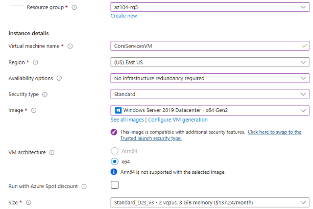
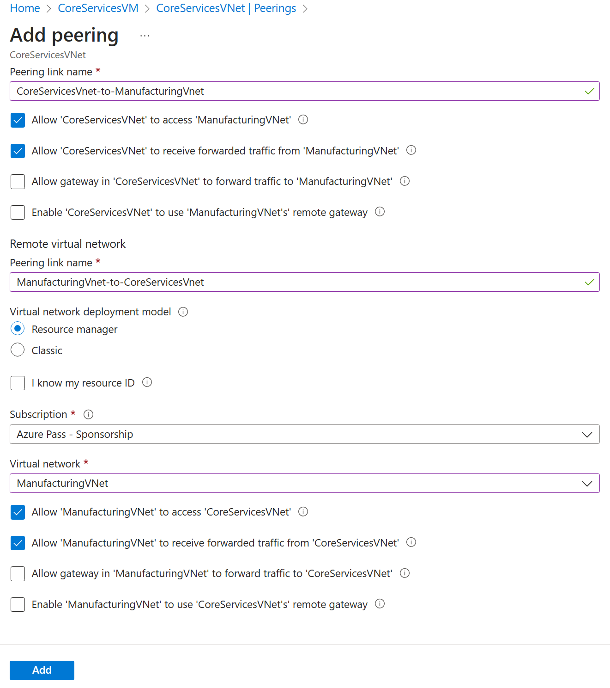
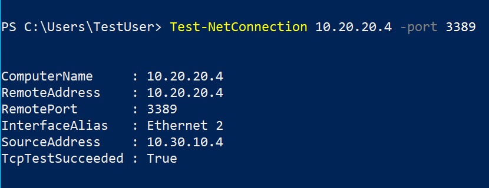

---
lab:
  title: 實驗室 05：實作站台間連線能力
  module: Administer Intersite Connectivity
---

# 實驗 05 - 實作站台間連線能力

## 實驗室簡介

在此實驗室中，您會探索虛擬網路之間的通訊。 您可以實作虛擬網路對等互連和測試連線。 您也會建立自定義路由。 

此實驗室需要 Azure 訂用帳戶。 您的訂用帳戶類型可能會影響此實驗室中功能的可用性。 您可以變更區域，但步驟是使用 **美國**東部撰寫。 

## 估計時間：50 分鐘
    
## 實驗案例 

您的組織會將核心 IT 應用程式和服務（例如 DNS 和安全性服務）與業務的其他部分區隔，包括您的製造部門。 不過，在某些案例中，核心區域中的應用程式和服務需要與製造區域中的應用程式和服務通訊。 在此實驗室中，您會設定區隔區域之間的連線。 這是將生產與開發分離，或將某個子公司與另一個子公司分開的常見案例。  

## 互動式實驗室模擬

您可能會發現數個互動式實驗室模擬適合本主題。 模擬可讓您以自己的步調點選類似的案例。 互動式模擬和此實驗室之間有差異，但許多核心概念都相同。 不需要 Azure 訂用帳戶。 

+ [使用全域虛擬網路對等互連](https://mslabs.cloudguides.com/guides/AZ-700%20Lab%20Simulation%20-%20Connect%20two%20Azure%20virtual%20networks%20using%20global%20virtual%20network%20peering) 連線 兩個 Azure 虛擬網路。 測試不同虛擬網路中兩部虛擬機之間的連線。 建立虛擬網路對等互連並重新測試。

+ [設定對虛擬網路的監視](https://learn.microsoft.com/training/modules/configure-monitoring-virtual-networks/)。 了解如何使用 Azure 網路監看員連線監視器、流量記錄、NSG 診斷和封包擷取來監視 Azure IaaS 網路資源的連線。

+ [實作月臺間連線](https://mslabs.cloudguides.com/en-us/guides/AZ-104%20Exam%20Guide%20-%20Microsoft%20Azure%20Administrator%20Exercise%209)。 執行範本以建立具有數部虛擬機的虛擬網路基礎結構。 設定虛擬網路對等互連並測試連線。 

## 架構圖


## 作業技能

+ 工作 1：在虛擬網路中建立虛擬機。
+ 工作 2：在不同的虛擬網路中建立虛擬機。
+ 工作3：使用 網路監看員來測試虛擬機之間的連線。 
+ 工作 4：設定不同虛擬網路之間的虛擬網路對等互連。
+ 工作 5：使用 Azure PowerShell 來測試虛擬機之間的連線。
+ 工作 6：建立自定義路由。 

## 工作 1：建立核心服務虛擬機和虛擬網路

在這項工作中，您會使用虛擬機建立核心服務虛擬網路。 

1. 登入 **Azure 入口網站** - `https://portal.azure.com`。

1. 搜尋並選取 `Virtual Machines`。

1. 從 [虛擬機] 頁面中，選取 [ **建立** ]，然後選取 **[Azure 虛擬機**]。

1. 在 [基本] 索引卷標上，使用下列資訊來完成窗體，然後選取 **[下一步：磁碟>**。 針對未指定的任何設定，保留預設值。
 
    | 設定 | 值 | 
    | --- | --- |
    | 訂用帳戶 |  *訂用帳戶* |
    | 資源群組 |  `az104-rg5`（如有必要， **** 新建。 )
    | 虛擬機器名稱 |    `CoreServicesVM` |
    | 區域 | **(美國) 美國東部** |
    | 可用性選項 | 不需要基礎結構備援 |
    | 安全性類型 | **標準** |
    | 映像 | **Windows Server 2019 Datacenter：x64 Gen2** （請注意您的其他選擇） |
    | 大小 | **Standard_DS2_v3** |
    | 使用者名稱 | `localadmin` | 
    | 密碼 | **提供複雜密碼** |
    | 公用輸入連接埠 | **None** |

    
   
1. 在 [ **磁碟** ] 索引標籤上採用預設值，然後選取 **[下一步：網络>**。

1. 在 [ **網络] 索引** 標籤上，針對 [虛擬網络]，選取 [ **新建**]。

1. 使用下列資訊來設定虛擬網路，然後選取 [ **確定**]。 如有必要，請移除或取代現有的資訊。

    | 設定 | 值 | 
    | --- | --- |
    | 名稱 | `CoreServicesVnet` （新增） |
    | 位址範圍 | `10.0.0.0/16`  |
    | 子網路名稱 | `Core` | 
    | 子網路位址範圍 | `10.0.0.0/24` |

1. 選取 [ **監視]** 索引標籤。針對 [開機診斷]，選取 [ **停用**]。

1. 選取 [檢閱 + 建立]，然後選取 [建立]。

1. 您不需要等候資源建立。 繼續進行下一個工作。

    >**注意：** 您在建立虛擬機時所建立的虛擬網路中是否注意到此工作？ 您也可以建立虛擬網路基礎結構，然後新增虛擬機。 

## 工作 2：在不同的虛擬網路中建立虛擬機

在這項工作中，您會使用虛擬機建立製造服務虛擬網路。 

1. 從 Azure 入口網站 搜尋並流覽至 **虛擬機器**。

1. 從 [虛擬機] 頁面中，選取 [ **建立** ]，然後選取 **[Azure 虛擬機**]。

1. 在 [基本] 索引卷標上，使用下列資訊來完成窗體，然後選取 **[下一步：磁碟>**。 針對未指定的任何設定，保留預設值。
 
    | 設定 | 值 | 
    | --- | --- |
    | 訂用帳戶 |  *訂用帳戶* |
    | 資源群組 |  `az104-rg5` |
    | 虛擬機器名稱 |    `ManufacturingVM` |
    | 區域 | **(美國) 美國東部** |
    | 安全性類型 | **標準** |
    | 可用性選項 | 不需要基礎結構備援 |
    | 映像 | **Windows Server 2019 Datacenter：x64 Gen2** |
    | 大小 | **Standard_DS2_v3** | 
    | 使用者名稱 | `localadmin` | 
    | 密碼 | **提供複雜密碼** |
    | 公用輸入連接埠 | **None** |

1. 在 [ **磁碟** ] 索引標籤上採用預設值，然後選取 **[下一步：網络>**。

1. 在 [網络] 索引標籤上，針對 [虛擬網络]，選取 [ **新建**]。

1. 使用下列資訊來設定虛擬網路，然後選取 [ **確定**]。  如有必要，請移除或取代現有的位址範圍。

    | 設定 | 值 | 
    | --- | --- |
    | 名稱 | `ManufacturingVnet` |
    | 位址範圍 | `172.16.0.0/16`  |
    | 子網路名稱 | `Manufacturing` |
    | 子網路位址範圍 | `172.16.0.0/24` |

1. 選取 [ **監視]** 索引標籤。針對 [開機診斷]，選取 [ **停用**]。

1. 選取 [檢閱 + 建立]，然後選取 [建立]。

## 工作3：使用 網路監看員來測試虛擬機之間的連線 


在這項工作中，您會確認對等互連虛擬網路中的資源可以彼此通訊。 網路監看員 將用來測試連線。 在繼續之前，請確定這兩部虛擬機都已部署並正在執行。 

1. 從 Azure 入口網站 搜尋並選取 `Network Watcher`。

1. 從 [網路監看員]，在 [網络診斷工具] 功能表中，選取 **[連線 ion 疑難解答**]。

1. 使用下列資訊來完成 連線 疑難解答**頁面上的**欄位。

    | 欄位 | 值 | 
    | --- | --- |
    | 來源類型           | **虛擬機器**   |
    | 虛擬機器       | **CoreServicesVM**    | 
    | 目的地類型      | **虛擬機器**   |
    | 虛擬機器       | **ManufacturingVM**   | 
    | 慣用IP版本  | **兩者**              | 
    | 通訊協定              | **TCP**               |
    | 目的地連接埠      | `3389`                |  
    | 來源連接埠           | *Blank*         |
    | 診斷測試      | *Defaults*      |

    

1. 選取 [執行診斷測試]****。

    >**注意**：傳回結果可能需要幾分鐘的時間。 收集結果時，螢幕選取專案會呈現灰色。 **請注意，連線 ivity 測試**會顯示 **UnReachable**。 這很合理，因為虛擬機位於不同的虛擬網路中。 

 
## 工作 4：設定虛擬網路之間的虛擬網路對等互連

在這項工作中，您會建立虛擬網路對等互連，以啟用虛擬網路中資源之間的通訊。 

1. 在 Azure 入口網站 中，選取`CoreServicesVnet`虛擬網路。

1. 在 CoreServicesVnet 的 [設定]**** 底下，選取 [對等互連]****。

1. 在 [CoreServicesVnet | 對等互連] 上，選取 [+ 新增]****。

1. 請使用下表中的資訊來建立對等互連。

| **參數**                                    | **值**                             |
| --------------------------------------------- | ------------------------------------- |
| **此虛擬網路**                                       |                                       |
| 對等互連連結名稱                             | `CoreServicesVnet-to-ManufacturingVnet` |
| 允許 CoreServicesVnet 存取對等互連的虛擬網路            | selected （default）                       |
| 允許 CoreServicesVnet 接收來自對等互連虛擬網路的轉送流量 | 已選取                       |
| 允許 CoreServicesVnet 中的閘道將流量轉送至對等互連的虛擬網路 | 未選擇 （預設值） |
| 啟用 CoreServicesVnt 以使用對等互連虛擬網路的遠端閘道       | 未選擇 （預設值）                        |
| **遠端虛擬網路**                                   |                                       |
| 對等互連連結名稱                             | `ManufacturingVnet-to-CoreServicesVnet` |
| 虛擬網路部署模型              | **資源管理員**                      |
| 我知道我的資源識別碼                         | 未選取                          |
| 訂用帳戶                                  | *訂用帳戶*    |
| 虛擬網路                               | **ManufacturingVnet**                     |
| 允許 ManufacturingVnet 存取 CoreServicesVnet  | selected （default）                       |
| 允許 ManufacturingVnet 接收來自 CoreServicesVnet 的轉送流量 | 已選取                        |
| 允許 CoreServicesVnet 中的閘道將流量轉送至對等互連的虛擬網路 | 未選擇 （預設值） |
| 啟用 ManufacturingVnet 以使用 CoreServicesVnet 的遠端閘道       | 未選擇 （預設值）                        |

1. 檢閱您的設定，然後選取 [ **新增**]。



 
1. 在 [CoreServicesVnet | 對等互連] 上，確認已列出 [CoreServicesVnet-to-ManufacturingVnet]**** 對等互連。 重新整理頁面，以確保**已 連線** 對等互連狀態****。

1. 切換至 **ManufacturingVnet** ，並確認 **已列出 ManufacturingVnet 對 CoreServicesVnet** 對等互連。 確定已 **連線 對等互連狀態****。** 您可能需要**重新整理**頁面。 


## 工作 5：使用 Azure PowerShell 來測試虛擬機之間的連線

在這項工作中，您會重新測試不同虛擬網路中虛擬機之間的連線。 

### 確認 CoreServicesVM 的私人 IP 位址

1. 從 Azure 入口網站 搜尋並選取`CoreServicesVM`虛擬機。

1. 在 [概觀]** 刀鋒視窗的 **[** 網络**] 區段中，記錄**機器的私人IP位址**。 您需要此資訊來測試連線。
   
### 從 ManufacturingVM 測試 CoreServicesVM** 的**連線。

>**你知道嗎？** 有許多方式可以檢查連線。 在此工作中，您會使用 **[執行] 命令**。 您也可以繼續使用 網路監看員。 或者，您可以使用[遠端桌面 連線](https://learn.microsoft.com/azure/virtual-machines/windows/connect-rdp#connect-to-the-virtual-machine) 存取虛擬機。 聯機之後，請使用 **test-connection**。 當您有時間時，請試試看 RDP。 

1. 切換至 `ManufacturingVM` 虛擬機。

1. 在 [ **作業]** 刀鋒視窗中，選取 [ **執行命令** ] 刀鋒視窗。

1. 選取 **[RunPowerShellScript**]，然後執行 **Test-Net 連線 ion** 命令。 請務必使用 CoreServicesVM** 的私人 **IP 位址。

    ```Powershell
    Test-NetConnection <CoreServicesVM private IP address> -port 3389
    ```
1. 腳本可能需要幾分鐘的時間才會逾時。頁面頂端會顯示資訊訊息 *腳本執行進行中。*

   
1. 測試連線應該會成功，因為已設定對等互連。 此圖形中的電腦名稱和遠端位址可能不同。 
   
   

## 工作 6：建立自定義路由 

在這項工作中，您想要控制周邊子網與內部核心服務子網之間的網路流量。 虛擬網路設備將會安裝在核心服務子網中，而且所有流量都應該路由傳送到該處。 

1. 搜尋 以選擇 。 `CoreServicesVnet`

1. 選取 [子網 **]，然後選取 ****[+ 建立**]。 請務必**儲存**您的變更。 

    | 設定 | 值 | 
    | --- | --- |
    | 名稱 | `perimeter` |
    | 子網路位址範圍 | `10.0.1.0/24`  |

   
1. 在 Azure 入口網站 中，搜尋並選取 `Route tables`，然後選取 [**建立**]。 

    | 設定 | 值 | 
    | --- | --- |
    | 訂用帳戶 | 訂用帳戶 |
    | 資源群組 | `az104-rg5`  |
    | 區域 | **美國東部** |
    | 名稱 | `rt-CoreServices` |
    | 散佈閘道路由 | **否** |

1. 部署路由表之後，選取 **[移至資源**]。

1. 選取 [路由]，然後選取 ****[+ 新增**]。** 建立從未來的 NVA 到 CoreServices 虛擬網路的路由。 

    | 設定 | 值 | 
    | --- | --- |
    | 路由名稱 | `PerimetertoCore` |
    | 目的地類型 | **IP 位址** |
    | 目的地 IP 位址 | `10.0.0.0/16` （核心服務虛擬網路） |
    | 下一個躍點類型 | **虛擬裝置** （請注意您的其他選擇） |
    | 下一個躍點位址 | `10.0.1.7` （未來 NVA） |

1. 完成路由時，請選取 **[+ 新增** ]。 最後一件事是將路由與子網產生關聯。

1. 選取 [子網 **]，然後選取 ****[關聯**]。 完成設定。

    | 設定 | 值 | 
    | --- | --- |
    | 虛擬網路 | **CoreServicesVnet** |
    | 子網路 | **核心** |    

>**注意**：您已建立使用者定義的路由，以將來自 DMZ 的流量導向至新的 NVA。  

## 清除您的資源

如果您使用自己的訂用 **帳戶** ，需要一分鐘的時間才能刪除實驗室資源。 這可確保資源可以釋出，並將成本降到最低。 刪除實驗室資源最簡單的方式是刪除實驗室資源群組。 

+ 在 Azure 入口網站 中，選取資源群組、選取 **[刪除資源群組**]、**輸入資源組名**，然後按兩下 [**刪除**]。
+ 使用 Azure PowerShell， `Remove-AzResourceGroup -Name resourceGroupName`。
+ 使用 CLI， `az group delete --name resourceGroupName`。


## 重要心得

恭喜您完成實驗室。 以下是此實驗室的主要外賣。 

+ 根據預設，不同虛擬網路中的資源無法通訊。
+ 虛擬網路對等互連可讓您順暢地連線 Azure 中的兩個或更多虛擬網路。
+ 對等互連的虛擬網路會以連線目的顯示為其中一個。
+ 對等互連虛擬網路中虛擬機器之間的流量會使用 Microsoft 骨幹基礎結構。
+ 系統定義的路由會自動針對虛擬網路中的每個子網建立。 用戶定義的路由會覆寫或新增至默認系統路由。 
+ Azure 網路監看員 提供一套工具來監視、診斷及檢視 Azure IaaS 資源的計量和記錄。

## 透過自學型訓練深入了解

+ [將您的服務分散到 Azure 虛擬網路，並使用虛擬網路對等互連](https://learn.microsoft.com/en-us/training/modules/integrate-vnets-with-vnet-peering/)加以整合。 使用虛擬網路對等互連，以安全且最不複雜的方式在虛擬網路之間進行通訊。
+ [使用路由](https://learn.microsoft.com/training/modules/control-network-traffic-flow-with-routes/)來管理和控制 Azure 部署中的流量流程。 了解如何藉由執行自訂路由來控制 Azure 虛擬網路流量。
