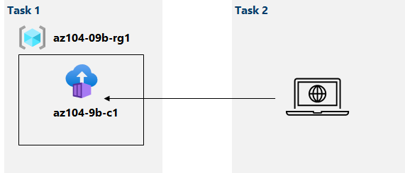

---
lab:
  title: 09b - 實作 Azure 容器執行個體
  module: Administer Serverless Computing
---

# 實驗 09b - 實作 Azure 容器執行個體
# 學員實驗手冊

## 實驗案例

Contoso 想要為其虛擬化工作負載尋找新的平台。 您已識別出一些容器映像，可用來達成此目標。 由於您想要將容器管理降到最低，因此您計畫評估使用 Azure 容器執行個體部署 Docker 映像。

**注意：** **[互動式實驗室模擬](https://mslabs.cloudguides.com/guides/AZ-104%20Exam%20Guide%20-%20Microsoft%20Azure%20Administrator%20Exercise%2014)** (英文) 可供您以自己的步調完成此實驗室。 您可能會發現互動式模擬與託管實驗室之間稍有差異，但所示範的核心概念與想法均相同。 

## 目標

在此實驗中，您將會：

- 工作 1：使用 Azure 容器執行個體部署 Docker 映像
- 工作 2：檢閱 Azure 容器執行個體功能

## 預估時間：20 分鐘

## 架構圖



### 指示

## 練習 1

## 工作 1：使用 Azure 容器執行個體部署 Docker 映像

在這個工作中，您將為 Web 應用程式建立一個新的容器執行個體。

1. 登入 [Azure 入口網站](https://portal.azure.com)。

1. 在 Azure 入口網站中，搜尋尋找**容器執行個體**，然後在 [容器執行個體] 刀鋒視窗上，按一下 [+ 建立]。

1. 在 [建立容器執行個體] 刀鋒視窗的 [基本] 索引標籤上，指定下列設定 (其他設定維持預設值)：

    | 設定 | 值 |
    | ---- | ---- |
    | 訂用帳戶 | 您要在此實驗室中使用的 Azure 訂用帳戶名稱 |
    | 資源群組 | 新資源群組 **az104-09b-rg1** 的名稱 |
    | 容器名稱 | **az104-9b-c1** |
    | 區域 | 您可以佈建 Azure 容器執行個體的區域功能變數名稱 |
    | 映像來源 | **快速入門映像** |
    | 映像 | **mcr.microsoft.com/azuredocs/aci-helloworld:latest (Linux)** |

1. 按一下 [下一步：**網路>]** ，然後在 [建立容器執行個體] 刀鋒視窗的 [網路] 索引標籤上，指定下列設定 (其他設定維持預設值)：

    | 設定 | 值 |
    | --- | --- |
    | DNS 名稱標籤 | 任何有效的全域唯一 DNS 主機名稱 |

    >**注意**：您的容器可以透過 dns-name-label.region.azurecontainer.io 供公眾存取。 如果您收到 **DNS 名稱標籤無法使用**錯誤訊息，請指定其他的值。

1. 按一下 [下一步：**進階>]** ，檢閱 [建立容器執行個體] 刀鋒視窗的 [進階] 索引標籤上的設定，而不進行任何變更，按一下 [檢閱 + 建立]，確定通過驗證，然後按一下 [建立]。

    >**注意**：等待部署完成。 這應該大約需要 3 分鐘的時間。

    >**注意**：在您等待的時候，可能會有興趣查看[範例應用程式背後的程式碼](https://github.com/Azure-Samples/aci-helloworld)。 若要檢視該程式碼，請瀏覽\\應用程式資料夾。

## 工作 2：檢閱 Azure 容器執行個體功能

在此工作中，您將檢閱容器執行個體的部署。

1. 在 [部署] 刀鋒視窗上，按一下 [移至資源] 連結。

1. 在容器執行個體的 [概觀] 刀鋒視窗上，確認 [狀態] 回報為 [執行中]。

1. 複製容器執行個體 **FQDN** 的值、開啟新的瀏覽器索引標籤，然後瀏覽至對應的 URL。

1. 確認 [歡迎使用 Azure 容器執行個體] 頁面顯示。

1. 關閉新的瀏覽器索引標籤，回到 [Azure 入口網站]，在容器執行個體刀鋒視窗的 [設定] 區段中，按一下 [容器]，然後按一下 [記錄]。

1. 在瀏覽器中顯示應用程式，確認您看到所產生代表 HTTP GET 要求的記錄項目。

## 清除資源

>**注意**：請記得移除您不再使用的任何新建立的 Azure 資源。 移除未使用的資源可確保您不會看到非預期的費用。

>**注意**：如果無法立即移除實驗資源，請不要擔心。 有時候資源具有相依性，需要經過很長的時間才能刪除。 這是監視資源使用量的常見系統管理員工作，因此只需定期檢閱入口網站中的資源，查看清除的運作情況便可。 

1. 在 Azure 入口網站中，在 [Cloud Shell] 窗格內開啟 [PowerShell] 工作階段。

    >**注意**：必須建立 Cloud Shell 儲存體，這些命令才能運作。 

1. 執行下列命令，列出在本課程模組的任何實驗中建立的所有資源群組：

   ```powershell
   Get-AzResourceGroup -Name 'az104-09b*'
   ```

1. 執行下列命令，刪除您在本課程模組的任何實驗中建立的所有資源群組：

   ```powershell
   Get-AzResourceGroup -Name 'az104-09b*' | Remove-AzResourceGroup -Force -AsJob
   ```

    >**注意**：此命令以非同步方式執行 (由 --AsJob 參數決定)，所以您隨後能夠在相同 PowerShell 工作階段內立即執行另一個 PowerShell 命令，但需要經過幾分鐘後，才會實際移除資源群組。

## 檢閱

在此實驗中，您已：

- 使用 Azure 容器執行個體部署 Docker 映像
- 檢閱 Azure 容器執行個體功能
