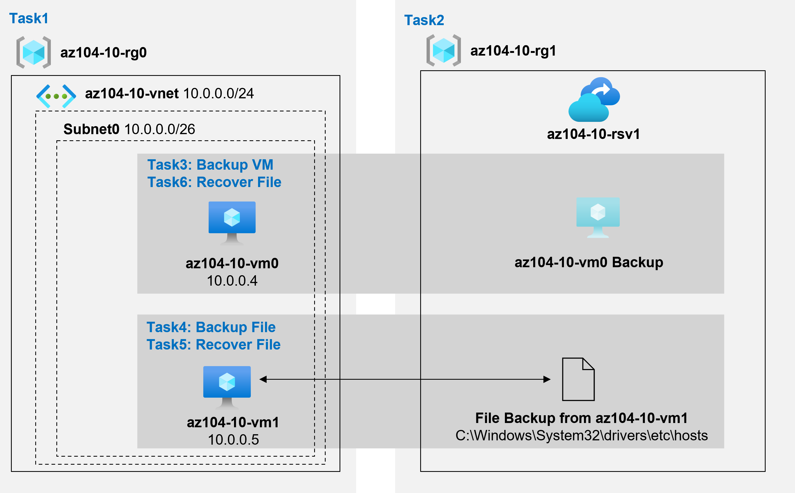

---
lab:
  title: 實驗室 10：實作資料保護
  module: Administer Data Protection
---

# 實驗室 10 – 備份虛擬機器
# 學生實驗室手冊

## 實驗室案例

您負責評估使用 Azure 復原服務來備份和還原裝載於 Azure 虛擬機器和內部部署電腦上的檔案。 此外，您想要找到保護復原服務保存庫中所儲存資料免於意外或惡意資料外洩的方法。

**注意：** **[互動式實驗室模擬](https://mslabs.cloudguides.com/guides/AZ-104%20Exam%20Guide%20-%20Microsoft%20Azure%20Administrator%20Exercise%2016)** (英文) 可供您以自己的步調完成此實驗室。 您可能會發現互動式模擬與託管實驗室之間稍有差異，但所示範的核心概念與想法均相同。 

## 目標

在此實驗中，您將會：

+ 工作 1：佈建實驗環境
+ 工作 2：建立恢復服務保存庫
+ 工作 3：實作 Azure 虛擬機器層級備份
+ 工作 4：實作檔案和資料夾備份
+ 工作 5：使用 Azure 復原服務代理程式來執行檔案復原
+ 工作 6：使用 Azure 虛擬機器快照集來執行檔案復原 (選用)
+ 工作 7：檢閱 Azure 復原服務虛刪除功能 (選用)

## 預估時間：50 分鐘

## 架構圖



### 指示

## 練習 1

## 工作 1：佈建實驗室環境

在此工作中，您將部署兩部虛擬機器，用來測試不同的備份案例。

1. 登入 [Azure 入口網站](https://portal.azure.com)。

1. 在 Azure 入口網站中，按一下 Azure 入口網站右上角的圖示以開啟 **Azure Cloud Shell**。

1. 當系統提示您選取 [Bash] 或 [PowerShell] 時，請選取 [PowerShell]。

    >**注意**：如果這是您第一次啟動 **Cloud Shell**，而且出現**您未掛接任何儲存體**訊息，請選取您在此實驗中使用的訂用帳戶，並按一下 [建立儲存體]。

1. 在 [Cloud Shell] 窗格的工具列中，按一下 [上傳/下載檔案] 圖示，在下拉式功能表中，按一下 [上傳]，並將檔案 **\\Allfiles\\Labs\\10\\az104-10-vms-edge-template.json** 和 **\\Allfiles\\Labs\\10\\az104-10-vms-edge-parameters.json** 上傳至 Cloud Shell 主目錄。

1. 從 [Cloud Shell] 窗格中，執行下列命令來建立裝載虛擬機器的資源群組 (將 `[Azure_region]` 預留位置取代為您想要部署 Azure 虛擬機器的 Azure 區域名稱)。 分別輸入每個命令列，並個別執行：

   ```powershell
   $location = '[Azure_region]'
    ```
    
   ```powershell
   $rgName = 'az104-10-rg0'
    ```
    
   ```powershell
   New-AzResourceGroup -Name $rgName -Location $location
   ```

1. 從 [Cloud Shell] 窗格中，執行下列命令以建立第一個虛擬網路，並使用您上傳的範本和參數檔案，將虛擬機器部署到其中：
    >**注意**：系統將會提示您提供管理員密碼。
    
   ```powershell
   New-AzResourceGroupDeployment `
      -ResourceGroupName $rgName `
      -TemplateFile $HOME/az104-10-vms-edge-template.json `
      -TemplateParameterFile $HOME/az104-10-vms-edge-parameters.json `
      -AsJob
   ```

1. 將 Cloud Shell 最小化 (但不關閉)。

    >**注意**：不須等待部署完成，請直接進行下一項工作。 此部署應需要大約 5 分鐘的時間。

## 工作 2：建立恢復服務保存庫

在此工作中，您將建立復原服務保存庫。

1. 在 Azure 入口網站中，搜尋並選取 [復原服務保存庫]，然後在 [復原服務保存庫] 刀鋒視窗上，按一下 [+ 建立]。

1. 在 [建立復原服務保存庫] 刀鋒視窗上，指定下列設定：

    | 設定 | 值 |
    | --- | --- |
    | 訂用帳戶 | 您要在此實驗室中使用的 Azure 訂用帳戶名稱 |
    | 資源群組 | 新資源群組 **az104-10-rg1** 的名稱 |
    | 保存庫名稱 | **az104-10-rsv1** |
    | 區域 | 您在上一個工作中部署兩部虛擬機器的區域名稱 |

    >**注意**：請確定指定與在上一項工作中部署虛擬機器的相同區域。

1. 按一下 [檢閱 + 建立]，確定通過驗證，然後按一下 [建立]。

    >**注意**：等待部署完成。 部署應該不到 1 分鐘便能完成。

1. 部署完成後，按一下 [前往資源]。

1. 在 [az104-10-rsv1] 復原服務保存庫刀鋒視窗的 [設定] 區段中，按一下 [屬性]。

1. 在 [az104-10-rsv1 - 屬性] 刀鋒視窗上，按一下 [備份設定] 標籤底下的 [更新] 連結。

1. 在 [ **備份組態** ] 刀鋒視窗中，檢閱儲存體 **複寫類型的**選擇。 保留 [異地備援] 的預設設定，並關閉刀鋒視窗。

    >**注意**：此設定只有在無現有備份項目時才能設定。

1. 回到 [az104-10-rsv1 - 屬性] 刀鋒視窗，按一下 [安全性設定] 標籤底下的 [更新] 連結。

1. 請注意，在 [安全性設定] 刀鋒視窗上，針對在 Azure 中執行的工作負載，[虛刪除] 為 [啟用]。

1. 關閉 [安全性設定] 刀鋒視窗，然後回到 [az104-10-rsv1] 復原服務保存庫刀鋒視窗，按一下 [概觀]。

## 工作 3：實作 Azure 虛擬機器層級備份

在此工作中，您將實作 Azure 虛擬機器層級備份。

   >**注意**：開始這項工作之前，請確定您在此實驗室第一個工作中起始的部署已成功完成。

1. 在 [az104-10-rsv1] 復原服務保存庫刀鋒視窗上，按一下 [概觀]，然後按一下 [+ 備份]。

1. 在 [備份目標] 刀鋒視窗上，指定以下設定：

    | 設定 | 值 |
    | --- | --- |
    | 您的工作負載在哪裡執行？ | **Azure** |
    | 您要備份什麼內容？ | **虛擬機器** |

1. 在 [備份目標] 窗格上，按一下 [備份]。

1. 在 [備份原則] 上，檢閱 [DefaultPolicy] 設定，然後選取 [建立新原則]。

1. 使用下列設定定義新的備份原則 (將其他設定保留預設值)：

    | 設定 | 值 |
    | ---- | ---- |
    | 原則名稱 | **az104-10-backup-policy** |
    | 頻率 | **每日** |
    | 時間 | **上午 12:00** |
    | 時區 | 當地時區的名稱 |
    | 保留立即復原快照集 | **2** 天 |

1. 按一下 [確定] 以建立原則，然後在 [虛擬機器] 區段中，選取 [新增]。

1. 在 [選取虛擬機器] 刀鋒視窗中，選取 [az-104-10-vm0]，按一下 [確定]，然後在 [備份] 刀鋒視窗上，按一下 [啟用備份]。

    >**注意**：請等候備份完成啟用。 這應該大約需要 2 分鐘的時間。

1. 瀏覽回到 [az104-10-rsv1] 復原服務保存庫刀鋒視窗，在 [受保護的項目] 區段中，按一下 [備份項目]，然後按一下 [Azure 虛擬機器] 項目。

1. 在 [備份專案 (Azure 虛擬機器)] 刀鋒視窗上，選取 [az104-10-vm0] 的 [檢視詳細資料] 連結，並檢閱 [備份檢查前] 和 [上次備份狀態] 項目的值。

1. 在 [az104-10-vm0] 備份項目刀鋒視窗中，按一下 [立即備份]，接受 [保留備份到] 下拉式清單中的預設值，然後按一下 [確定]。

    >**注意**：不必等待備份完成，直接繼續進行下一個工作。

## 工作 4：實作檔案和資料夾備份

在此工作中，您將使用 Azure 復原服務來實作檔案和資料夾備份。

1. 在 Azure 入口網站中，搜尋並選取 [虛擬機器]，然後在 [虛擬機器] 刀鋒視窗中，按一下 [az104-10-vm1]。

1. 在 [az104-10-vm1] 刀鋒視窗上，按一下 [連線]，在下拉式功能表中，按一下 [RDP]，在 [透過 RDP 連線] 刀鋒視窗上，按一下 [下載 RDP 檔案]，然後遵循提示來啟動遠端桌面工作階段。

    >**注意**：此步驟是指透過遠端桌面從 Windows 電腦進行連線。 在 Mac 電腦上，您可以使用 Mac App Store 的遠端桌面用戶端；而在 Linux 電腦上，您可以使用開放原始碼 RDP 用戶端軟體。

    >**注意**：連線至目標虛擬機器時，您可以忽略任何警告提示。

1. 出現提示時，請使用參數檔案中的 **Student** 使用者名稱和密碼登入。

    >**注意：** 由於 Azure 入口網站不再支援 IE11，所以針對這項工作您必須使用 Microsoft Edge 瀏覽器。

1. 在 [az104-10-vm1] Azure 虛擬機器的遠端桌面工作階段內，啟動 Edge 網頁瀏覽器、瀏覽至 [Azure 入口網站](https://portal.azure.com)，然後使用您的認證登入。

1. 在 Azure 入口網站中，搜尋並選取 [復原服務保存庫]，然後在 [復原服務保存庫] 上按一下 [az104-10-rsv1]。

1. 在 [az104-10-rsv1] 復原服務保存庫刀鋒視窗上，按一下 [+ 備份]。

1. 在 [備份目標] 刀鋒視窗上，指定以下設定：

    | 設定 | 值 |
    | --- | --- |
    | 您的工作負載在哪裡執行？ | **內部部署** |
    | 您要備份什麼內容？ | **檔案和資料夾** |

    >**注意**：雖然您於此工作中所使用的虛擬機器是在 Azure 中執行，但仍可以用以評估任何運行 Windows Server 作業系統內部部署電腦適用的備份功能。

1. 在 [備份目標] 刀鋒視窗上，按一下 [準備基礎結構]。

1. 在 [準備基礎結構]刀鋒視窗上，按一下 [下載 Windows Server 或 Windows Client 的代理程式] 連結。

1. 出現提示時，按一下 [執行] 以使用預設設定開始安裝 **MARSAgentInstaller.exe**。

    >**注意**：在 **Microsoft Azure 復原服務代理程度設定精靈**的 [Microsoft Update 選擇加入] 頁面上，選取 [我不要使用 Microsoft Update] 選項。

1. 在 **Microsoft Azure 復原服務代理程式設定精靈**的 [安裝] 頁面上，按一下 [繼續註冊]。 這會啟動 [註冊伺服器精靈]。

1. 切換至顯示 Azure 入口網站的網頁瀏覽器視窗，在 [準備基礎結構] 刀鋒視窗上，選取 [已下載或正在使用最新的復原伺服器代理程式] 核取方塊，然後按一下 [下載]。

1. 出現提示時，無論是開啟或儲存保存庫認證檔案，請按一下 [儲存]。 這會將保存庫認證檔案儲存到本機「下載」資料夾。

1. 切換回 [註冊伺服器精靈] 視窗，然後在 [保存庫識別] 頁面上，按一下 [瀏覽]。

1. 在 [選取保存庫認證] 對話方塊中，瀏覽至 [下載] 資料夾，按一下您下載的保存庫認證檔案，然後按一下 [開啟]。

1. 回到 [保存庫識別] 頁面，按 [下一步]。

1. 確定未核**取將複雜密碼安全地儲存至 Azure 金鑰保存庫**。 

1. 在 [註冊伺服器精靈] 的 [加密設定] 頁面上，按一下 [產生複雜密碼]。

1. 在 [註冊伺服器精靈] 的 [加密設定] 頁面上，按一下 [輸入複雜密碼儲存位置] 旁的 [瀏覽] 按鈕以儲存複雜密碼。

1. 在 [瀏覽資料夾] 對話方塊，選取 [文件] 資料夾，並按一下 [確定]。

1. 按一下 [完成]，檢閱 **Microsoft Azure 備份**警告，然後按一下 [是]，並等候註冊完成。

    >**注意**：在實際執行環境中，您應該將複雜密碼檔案儲存在所備份伺服器以外的安全位置。

1. 在 [註冊伺服器精靈] 的 [伺服器註冊] 頁面上，檢閱複雜密碼檔案位置的相關警告，確定已選取 [啟動 Microsoft Azure 復原服務代理程式] 核取方塊，然後按一下 [關閉]。 這會自動開啟 [Microsoft Azure 備份] 主控台。

1. 在 [Microsoft Azure 備份] 主控台的 [動作] 窗格中，按一下 [排程備份]。

1. 在 [排程備份精靈] 的 [入門] 頁面上，按一下 [下一步]。

1. 在 [選取要備份的項目] 頁面上，按一下 [新增項目]。

1. 在 [選取項目] 對話方塊中，展開 **C:\\Windows\\System32\\drivers\\etc\\** ，選取 **hosts**，然後按一下 [確定]：

1. 在 [選取要備份的項目] 頁面上，按 [下一步]。

1. 在 [指定備份排程] 頁面上，確定已選取 [天] 選項，在 [於下列時間 (一天最多允許三次)] 方塊下方的第一個下拉式清單方塊中，選取 [上午 4:30]，然後按 [下一步]。

1. 在 [選取保留原則] 頁面上，接受預設值，然後按 [下一步]。

1. 在 [選擇初始備份類型] 頁面上，接受預設值，然後按 [下一步]。

1. 在 [確認]**** 頁面上，按一下 [完成]****。 備份排程建立後，按一下 [關閉]。

1. 在 [Microsoft Azure 備份] 主控台的 [動作] 窗格中，按一下 [立即備份]。

    >**注意**：建立排程備份之後，將可使用視需要執行備份的選項。

1. 在 [立即備份精靈] 的 [選取備份專案] 頁面上，確定已選取 [檔案及資料夾] 選項，然後按 [下一步]。

1. 在 [保留備份到] 頁面上，接受預設設定，然後按 [下一步]。

1. 在 [確認] 頁面上，按一下 [備份]。

1. 備份完成時，按一下 [關閉]，然後關閉 Microsoft Azure 備份。

1. 切換至顯示 Azure 入口網站的網頁瀏覽器視窗，瀏覽回到 [復原服務保存庫] 刀鋒視窗，在 [受保護的項目] 區段中，按一下 [備份項目]。

1. 在 [az104-10-rsv1 - 備份項目] 刀鋒視窗上，按一下 [Azure 備份代理程式]。

1. 在 [備份項目 (Azure 備份代理程式)] 刀鋒視窗中，確認有項目參考 [az104-10-vm1.] 的 **C:\\** 磁碟機。

## 工作 5：使用 Azure 復原服務代理程式來執行檔案復原 (選用)

在這項工作中，您將使用 Azure 復原服務代理程式執行檔案還原。

1. 在 [az104-10-vm1] 的遠端桌面工作階段內，開啟檔案總管，瀏覽至 **C:\\Windows\\System32\\drivers\\etc\\** 資料夾，並刪除 **hosts** 檔案。

1. 開啟 Microsoft Azure 備份，然後按一下 [動作] 窗格中的 [復原資料]。 此動作會啟動 [復原資料精靈]。

1. 在 [復原資料精靈] 的 [入門] 頁面上，確保已選取 [本台伺服器 (az104-10-vm1.)] 選項，然後按 [下一步]。

1. 在 [選取復原模式] 頁面上，確定已選取 [個別檔案與資料夾] 選項，然後按一下 [下一步]。

1. 在 [選取磁碟區和日期] 頁面上的 [選取磁碟區] 下拉式清單中，選取 **C:\\** ，接受可用備份的預設選項，然後按一下 [裝載]。

    >**注意**：等候裝載作業完成。 這大約需要 2 分鐘。

1. 在 [瀏覽及復原檔案] 頁面上，記下復原磁碟區的磁碟機代號，並檢閱使用 robocopy 的相關提示。

1. 按一下 [開始]，展開 [Windows 系統] 資料夾，然後按一下 [命令提示字元]。

1. 從命令提示字元執行下列命令，將 **hosts** 檔案還原至原始位置 (以您稍早所識別復原磁碟區的磁碟機代號取代 `[recovery_volume]`)：

   ```sh
   robocopy [recovery_volume]:\Windows\System32\drivers\etc C:\Windows\system32\drivers\etc hosts /r:1 /w:1
   ```

1. 切換回 [復原資料精靈]，然後在 [瀏覽及復原檔案] 上按一下 [卸載]，當系統提示您確認時，按一下 [是]。

1. 終止遠端桌面工作階段。

## 工作 6：使用 Azure 虛擬機器快照集來執行檔案復原 (選用)

在此工作中，您將從 Azure 虛擬機器層級快照集備份還原檔案。

1. 切換至在實驗室電腦上執行的瀏覽器視窗，並顯示 Azure 入口網站。

1. 在 Azure 入口網站中，搜尋並選取 [虛擬機器]，然後在 [虛擬機器] 刀鋒視窗中，按一下 [az104-10-vm0]。

1. 在 [az104-10-vm0] 刀鋒視窗上，按一下 [連線]，在下拉式功能表中，按一下 [RDP]，在 [透過 RDP 連線] 刀鋒視窗上，按一下 [下載 RDP 檔案]，然後遵循提示來啟動遠端桌面工作階段。

    >**注意**：此步驟是指透過遠端桌面從 Windows 電腦進行連線。 在 Mac 電腦上，您可以使用 Mac App Store 的遠端桌面用戶端；而在 Linux 電腦上，您可以使用開放原始碼 RDP 用戶端軟體。

    >**注意**：連線至目標虛擬機器時，您可以忽略任何警告提示。

1. 出現提示時，請使用參數檔案中的 **Student** 使用者名稱和密碼登入。

   >**注意：** 由於 Azure 入口網站不再支援 IE11，所以針對這項工作您必須使用 Microsoft Edge 瀏覽器。

1. 在 **az104-10-vm0** 的遠端桌面工作階段中，按一下 [開始]，展開 [Windows 系統] 資料夾，然後按一下 [命令提示字元]。

1. 從命令提示字元中，執行下列命令以刪除 **hosts** 檔案：

   ```sh
   del C:\Windows\system32\drivers\etc\hosts
   ```

   >**注意**：稍後在此工作中，您將從 Azure 虛擬機器層級快照集備份還原此檔案。

1. 在 [az104-10-vm0] Azure 虛擬機器的遠端桌面工作階段內，啟動 Edge 網頁瀏覽器、瀏覽至 [Azure 入口網站](https://portal.azure.com)，然後使用您的認證登入。

1. 在 Azure 入口網站中，搜尋並選取 [復原服務保存庫]，然後在 [復原服務保存庫] 上按一下 [az104-10-rsv1]。

1. 在 [az104-10-rsv1] 復原服務保存庫刀鋒視窗的 [受保護的項目] 區段中，按一下 [備份項目]。

1. 在 [az104-10-rsv1 - 備份項目] 刀鋒視窗上，按一下 [Azure 虛擬機器]。

1. 在 [備份專案 (Azure 虛擬機器)] 刀鋒視窗上，選取 [az104-10-vm0] 的 [檢視詳細資料]。

1. 在 [az104-10-vm0] 備份項目刀鋒視窗中，按一下 [檔案修復]。

    >**注意**：您可以選擇在備份根據應用程式一致快照集啟動之後，立即執行復原。

1. 在 [檔案復原] 刀鋒視窗上，接受預設復原點，然後按 [下載可執行檔]。

    >**注意**：指令碼會將所選復原點中的磁碟裝載為執行指令碼作業系統內的本機磁碟機。

1. 按 [下載]，並在系統提示您執行或儲存 **IaaSVMILRExeForWindows.exe** 時，按一下 [儲存]。

1. 回到 [檔案總管] 視窗中，按兩下新下載的檔案。

1. 當系統提示您從入口網站提供密碼時，請從 [檔案復原] 刀鋒視窗上 [用以執行指令碼的密碼] 文字方塊複製密碼，並貼到命令提示字元，然後按下 **Enter**。

    >**注意**：這會開啟顯示裝載進度的 Windows PowerShell 視窗。

    >**注意**：如果您此時收到錯誤訊息，請重新整理網頁瀏覽器視窗，並重複最後三個步驟。

1. 等候裝載程序完成、檢閱 Windows PowerShell 視窗中的資訊訊息、記下指派給磁碟區裝載 **Windows** 的磁碟機代號，然後啟動檔案總管。

1. 在檔案總管中，瀏覽至裝載您在上一個步驟中所識別作業系統磁碟區快照集的磁碟機代號，並檢閱其內容。

1. 切換至 [命令提示字元] 視窗中。

1. 從命令提示字元執行下列命令，將 **hosts** 檔案還原至原始位置 (以您稍早所識別作業系統磁碟區的磁碟機代號取代 `[os_volume]`)：

   ```sh
   robocopy [os_volume]:\Windows\System32\drivers\etc C:\Windows\system32\drivers\etc hosts /r:1 /w:1
   ```

1. 切換回 Azure 入口網站中的 [檔案復原] 刀鋒視窗，然後按一下 [卸載磁碟]。

1. 終止遠端桌面工作階段。

## 工作 7：檢閱 Azure 復原服務虛刪除功能

1. 在實驗室電腦上，從 Azure 入口網站中搜尋並選取 [復原服務保存庫]，然後在 [復原服務保存庫] 上按一下 [az104-10-rsv1]。

1. 在 [az104-10-rsv1] 復原服務保存庫刀鋒視窗的 [受保護的項目] 區段中，按一下 [備份項目]。

1. 在 [az104-10-rsv1 - 備份項目] 刀鋒視窗上，按一下 [Azure 備份代理程式]。

1. 在 [備份項目 (Azure 備份代理程式)] 刀鋒視窗中，按一下代表 **az104-10-vm1** 備份的項目。

1. 在 [C:\\ on az104-10-vm1.] 刀鋒視窗上，選取 [az104-10-vm1.] 的 [檢視詳細資料]。 .

1. 在 [詳細資料] 刀鋒視窗上，按一下 [az104-10-vm1]。

1. 在 **az104-10-vm1.** [受保護的伺服器] 刀鋒視窗，按一下 [刪除]。

1. 在 [刪除] 刀鋒視窗上，指定以下設定。

    | 設定 | 值 |
    | --- | --- |
    | 輸入伺服器名稱 | **az104-10-vm1.** |
    | 原因 | **回收開發/測試伺服器** |
    | 註解 | **az104 10 lab** |

    >**注意**：輸入伺服器名稱時，請務必包含尾端句點

1. 啟用下列標籤旁邊的核取方塊：**有 1 個備份項目的備份資料與此伺服器建立關聯。我了解按一下 [確認] 將會永久刪除所有雲端備份資料。此動作無法復原。系統可能會傳送警示給此訂用帳戶的系統管理員，通知他們此項刪除作業**，並按一下 [刪除]。

    >**注意**：此操作將會失敗，因為必須停用 [虛刪除] 功能。

1. 瀏覽回到 [az104-10-rsv1 - 備份項目] 刀鋒視窗，然後按一下 [Azure 虛擬機器]。

1. 在 [az104-10-rsv1 - 備份項目] 刀鋒視窗上，按一下 [Azure 虛擬機器]。

1. 在 [備份專案 (Azure 虛擬機器)] 刀鋒視窗上，選取 [az104-10-vm0] 的 [檢視詳細資料]。

1. 在 [az104-10-vm0] 備份項目刀鋒視窗中，按一下 [停止備份]。

1. 在 [停止備份] 刀鋒視窗中，選取 [刪除備份資料]，指定下列設定，然後按一下 [停止備份]：

    | 設定 | 值 |
    | --- | --- |
    | 輸入備份項目的名稱 | **az104-10-vm0** |
    | 原因 | **其他** |
    | 註解 | **az104 10 lab** |

1. 瀏覽回到 [az104-10-rsv1 - 備份項目] 刀鋒視窗，然後按一下 [重新整理]。

    >**注意**：[Azure 虛擬機器] 項目仍會列出 **1** 個備份項目。

1. 按一下 [Azure 虛擬機器] 項目，然後在 [備份專案 (Azure 虛擬機器)] 刀鋒視窗上，按一下 [az104-10-vm0] 項目。

1. 在 [az104-10-vm0] 備份項目刀鋒視窗上，請注意，您可以選擇將已刪除的備份 [取消刪除]。

    >**注意**：此功能是由虛刪除功能支援，Azure 虛擬機器備份預設會啟用此功能。

1. 瀏覽回到 [az104-10-rsv1] 復原服務保存庫刀鋒視窗，並在 [設定] 區段中按一下 [屬性]。

1. 在 [az104-10-rsv1 - 屬性] 刀鋒視窗上，按一下 [安全性設定] 標籤底下的 [更新] 連結。

1. 在 [安全性設定] 刀鋒視窗上，停用 [虛刪除 (針對在 Azure 中執行的工作負載)]，並停用 [安全性功能 (針對在內部部署執行的工作負載)]，然後按一下 [儲存]。

    >**注意**：這不會影響已處於虛刪除狀態的項目。

1. 關閉 [安全性設定] 刀鋒視窗，然後回到 [az104-10-rsv1] 復原服務保存庫刀鋒視窗，按一下 [概觀]。

1. 瀏覽回到 [az104-10-vm0] 備份項目刀鋒視窗，然後按一下 [取消刪除]。

1. 在 [取消刪除 az104-10-vm0] 刀鋒視窗上，按一下 [取消刪除]。

1. 等候取消刪除作業完成，視需要重新整理網頁瀏覽器頁面，瀏覽回到 [az104-10-vm0] 備份項目刀鋒視窗，然後按一下 [刪除備份資料]。

1. 在 [刪除備份資料] 刀鋒視窗上，指定以下設定並按一下 [刪除]：

    | 設定 | 值 |
    | --- | --- |
    | 輸入備份項目的名稱 | **az104-10-vm0** |
    | 原因 | **其他** |
    | 註解 | **az104 10 lab** |

1. 重複這項工作開頭的步驟，以刪除 **az104-10-vm1** 的備份項目。

## 清除資源

>**注意**：請記得移除您不再使用的任何新建立的 Azure 資源。 移除未使用的資源可確保您不會看到非預期的費用。

>**注意**：如果無法立即移除實驗資源，請不要擔心。 有時候資源具有相依性，需要經過較長的時間才能刪除。 這是監視資源使用量的常見系統管理員工作，因此只需定期檢閱入口網站中的資源，查看清除的運作情況便可。 

1. 在 Azure 入口網站中，在 [Cloud Shell] 窗格內開啟 [PowerShell] 工作階段。

1. 執行下列命令，列出在本課程模組的任何實驗中建立的所有資源群組：

   ```powershell
   Get-AzResourceGroup -Name 'az104-10*'
   ```

1. 執行下列命令，刪除您在本課程模組的任何實驗中建立的所有資源群組：

   ```powershell
   Get-AzResourceGroup -Name 'az104-10*' | Remove-AzResourceGroup -Force -AsJob
   ```

   >**注意**：您可以選擇刪除具有前置詞 **AzureBackupRG_** 的自動產生資源群組 (此群組的存在不會產生相關的額外費用)。

    >**注意**：此命令以非同步方式執行 (由 --AsJob 參數決定)，所以您隨後能夠在相同 PowerShell 工作階段內立即執行另一個 PowerShell 命令，但需要經過幾分鐘後，才會實際移除資源群組。

## 檢閱

在此實驗中，您已：

+ 佈建實驗環境
+ 建立復原服務保存庫
+ 實作 Azure 虛擬機器層級備份
+ 實作檔案和資料夾備份
+ 使用 Azure 復原服務代理程式來執行檔案復原
+ 使用 Azure 虛擬機器快照集來執行檔案復原
+ 檢閱 Azure 復原服務虛刪除功能
